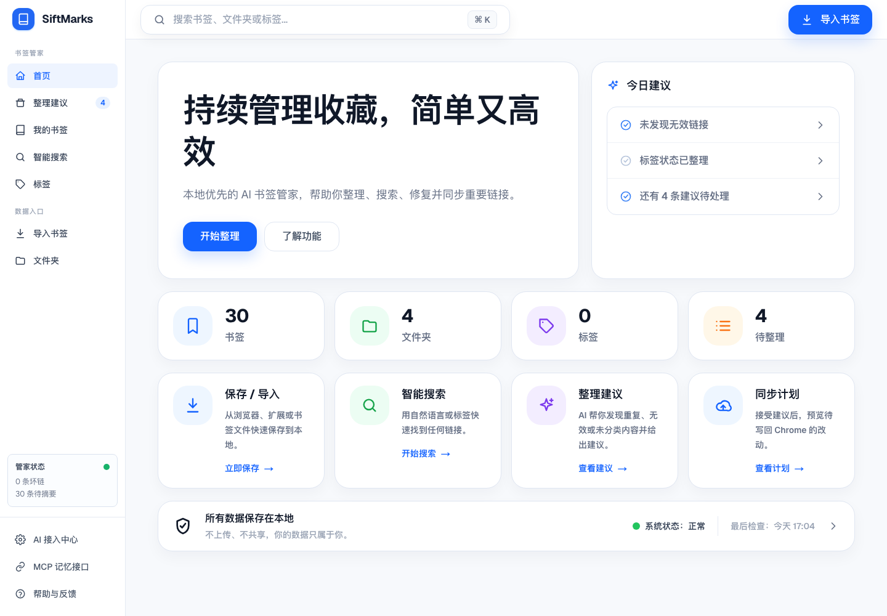
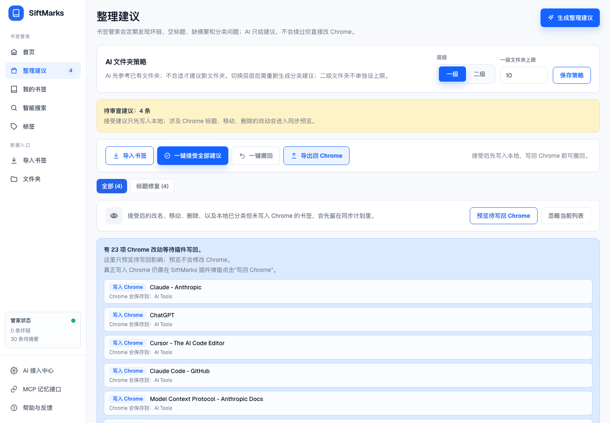
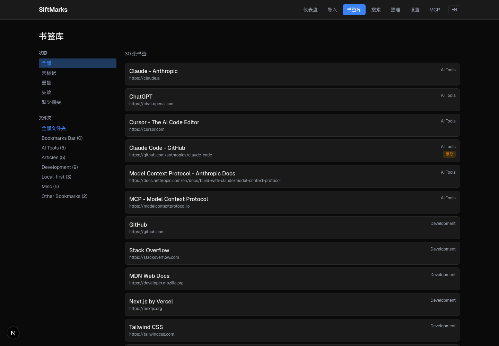
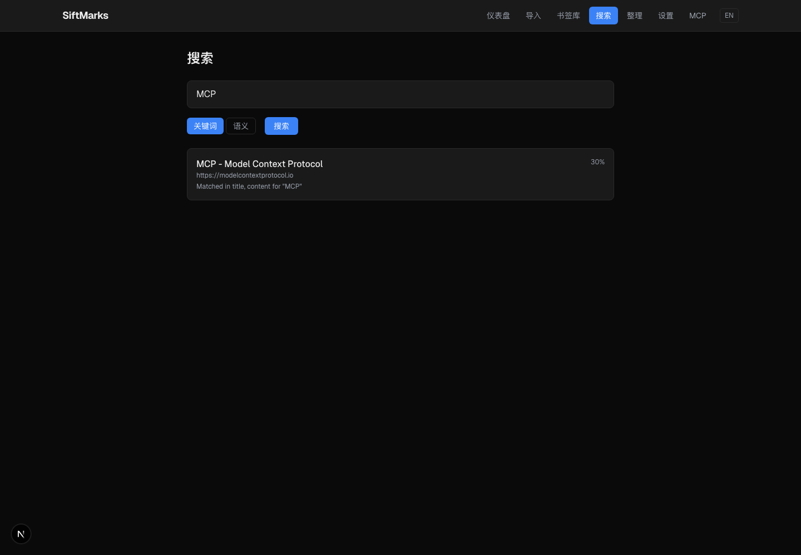
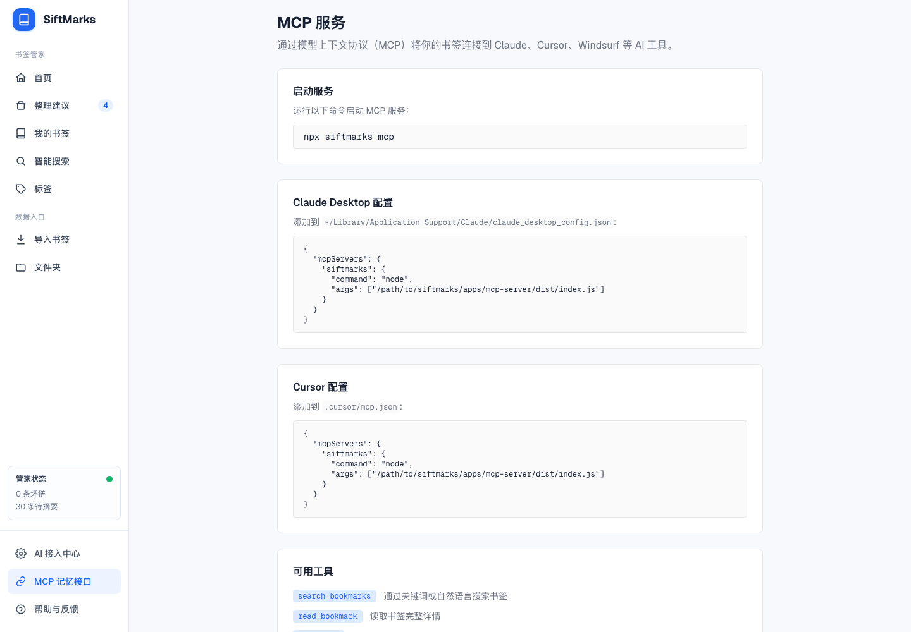

# SiftMarks

[简体中文](./README.md) | English

[](https://github.com/Lling0000/SiftMarks/actions/workflows/ci.yml)
[](./LICENSE)


**A local-first bookmark rescue and AI memory layer for Chrome.**

Your bookmarks are probably the largest private knowledge base you already own, but the browser mostly treats them as a flat list of titles, URLs, and folders. SiftMarks turns that neglected browser state into a local, reviewable, AI-ready memory layer.

It imports the real Chrome bookmark tree, detects decay such as duplicates, vague titles, broken-link status, and folder drift, lets you review cleanup like a pull request, syncs accepted changes back to Chrome, and exposes the cleaned library to AI tools through MCP.

It does not replace your browser or silently reorganize your bookmarks. It makes the knowledge you already saved searchable, auditable, and useful as private AI context.



[Watch the 20-second demo](./docs/demo/siftmarks-demo.mp4)

## Why It Exists

Browser bookmarks are great at capturing intent in the moment and weak at preserving context over time. After enough imports, migrations, and late-night saves, the bookmark bar turns into duplicate URLs, vague titles, dead links, and folders nobody remembers designing.

SiftMarks is for people whose browser quietly became a second brain:

- developers collecting docs, issues, repos, and MCP tools
- researchers saving papers, articles, datasets, and references
- founders and operators tracking competitors, internal tools, and market notes
- anyone who knows they saved the page but not the exact title

## What It Does

| Capability | Status |
| --- | --- |
| Chrome bookmark import | Available through the local web app and Chrome extension |
| Local library | SQLite database at `~/.siftmarks/siftmarks.sqlite` by default |
| Keyword search | Available with SQLite FTS |
| Memory search | Available in the web search UI; uses embeddings when an AI provider has generated them, otherwise falls back to keyword-style results |
| Bookmark Rescue | Generates reviewable cleanup suggestions for duplicates, vague titles, broken-link status, tags, and moves |
| Chrome sync-back | Applies accepted rename, move, duplicate-merge, and broken-link deletion operations through the extension |
| AI metadata | Mock mode by default; OpenAI-compatible and Ollama-compatible providers can generate summaries, tags, embeddings, titles, rescue suggestions, and taxonomy moves |
| MCP server | Lets Claude, Cursor, Windsurf, and other MCP clients search, read, summarize, save, and rescue bookmarks |

## Why Not Built-In Bookmark Search?

Chrome bookmark search is useful when you remember the exact title or URL. It does not solve the bigger lifecycle problem:

| Native browser bookmarks | SiftMarks |
| --- | --- |
| Searches title, URL, and folder | Searches the local indexed library, tags, summaries, and generated metadata |
| Shows the current mess | Creates cleanup suggestions you can review first |
| Lives inside one browser UI | Exposes bookmarks to AI tools through MCP |
| Edits happen directly | Accepted changes are staged in SiftMarks, then confirmed before sync-back |
| Browser sync is all-or-nothing | Local SQLite remains inspectable; Chrome Sync only applies if you choose to sync changes back and Chrome Sync is enabled |

The goal is not to replace Chrome bookmarks. The goal is to make them recoverable, searchable, and useful as AI context.

## Quick Start

Requirements:

- Node.js 18+
- npm
- Google Chrome for extension import and sync-back

```bash
git clone https://github.com/Lling0000/SiftMarks.git
cd SiftMarks
npm install
npm run build:packages
npm run dev
```

Open the local dashboard:

[http://localhost:4399](http://localhost:4399)

SiftMarks stores data locally by default:

```text
~/.siftmarks/siftmarks.sqlite
```

Try the sample bookmark file without touching your real library:

```bash
SIFTMARKS_HOME=/tmp/siftmarks-demo npm run cli -- init
SIFTMARKS_HOME=/tmp/siftmarks-demo npm run cli -- import examples/bookmarks.html
SIFTMARKS_HOME=/tmp/siftmarks-demo npm run cli -- search "mcp"
SIFTMARKS_HOME=/tmp/siftmarks-demo npm run cli -- rescue
```

## Chrome Workflow

### 1. Start The Local App

```bash
npm run build:packages
npm run dev
```

Open:

```text
http://localhost:4399
```

### 2. Load The Extension

The extension talks to the local app at `http://localhost:4399`.

1. Open `chrome://extensions`.
2. Enable **Developer mode**.
3. Click **Load unpacked**.
4. Select `apps/chrome-extension`.
5. Click the SiftMarks extension icon.

### 3. Import Bookmarks

Use **Import All Browser Bookmarks** in the extension, or import a browser-exported `bookmarks.html` file from the web app.

The import path keeps Chrome IDs when importing from the extension, which is what allows accepted cleanup suggestions to sync back to the original browser bookmarks later.

### 4. Review Cleanup Suggestions

Open:

```text
http://localhost:4399/rescue
```

Generate suggestions, inspect the before/after JSON, accept what looks right, and dismiss the rest. SiftMarks treats bookmark cleanup like a pull request: nothing touches Chrome until you explicitly sync.

### 5. Sync Accepted Changes Back To Chrome

Click **Sync Back to Chrome** in the extension. The extension will ask for confirmation before it modifies browser bookmarks.

Supported sync-back operations:

- rename accepted bookmarks
- move accepted bookmarks into target folders
- remove duplicate bookmarks selected for merge
- remove bookmarks marked as broken
- clean up duplicate URLs and empty folders after move/remove operations

If Chrome Sync is enabled, Chrome may sync those browser-side changes to your Google account.

## MCP Server

SiftMarks can expose your local bookmark library to MCP clients.

Build the server:

```bash
npm run build:packages
```

Start it manually:

```bash
npm run cli -- mcp
```

Claude Desktop example:

```json
{
  "mcpServers": {
    "siftmarks": {
      "command": "node",
      "args": ["/absolute/path/to/SiftMarks/apps/mcp-server/dist/index.js"]
    }
  }
}
```

Available MCP tools:

| Tool | Purpose |
| --- | --- |
| `search_bookmarks` | Search saved bookmarks |
| `read_bookmark` | Read one bookmark in detail |
| `list_tags` | List tags and counts |
| `list_folders` | List folders and counts |
| `find_related_bookmarks` | Find related saved pages |
| `summarize_collection` | Summarize by tag or folder |
| `save_bookmark` | Save a new bookmark |
| `run_bookmark_rescue` | Generate cleanup suggestions |
| `get_bookmark_stats` | Get library statistics |

## Screenshots

### Review Cleanup Like A Pull Request

Accept, dismiss, or batch-apply cleanup suggestions before anything touches Chrome.



### Browse A Clean Local Library

Filter by status, folder, duplicate state, missing metadata, and saved context.



### Search By What You Remember

Use keyword search immediately. Switch to memory mode after summaries and embeddings have been generated by a configured provider.



### Connect Bookmarks To AI Tools

Expose your local bookmark library to Claude, Cursor, Windsurf, and other MCP clients.



More product screens are available in [`docs/screenshots`](./docs/screenshots).

## AI Providers

SiftMarks starts in **Mock** mode. Mock mode does not call external AI APIs.

| Mode | What it enables |
| --- | --- |
| **Mock** | Local testing, FTS indexing, and rule-based rescue with no external AI calls |
| **OpenAI Compatible** | Summaries, tags, embeddings, title suggestions, AI rescue, and taxonomy classification through OpenAI, Azure OpenAI, Groq, Together, or compatible endpoints |
| **Ollama Compatible** | Local-model summaries, tags, embeddings, and classification through Ollama-style APIs |

Configure providers in the web **Settings** page. External AI calls only happen after you configure a provider and run an AI-backed action such as indexing, taxonomy generation, or AI rescue.

## Privacy Model

SiftMarks is local-first by design:

- No account is required.
- Bookmark data is stored in local SQLite by default.
- The Chrome extension only talks to `localhost:4399`.
- No telemetry is sent by the app.
- API keys are stored as local settings and are not logged.
- External AI calls are disabled unless you explicitly configure a provider.
- Chrome sync-back is explicit and confirmation-gated.

See [`docs/PRIVACY.md`](./docs/PRIVACY.md) for the practical data-flow model.

## CLI

Build first:

```bash
npm run build:packages
```

Then use the local CLI:

```bash
npm run cli -- init
npm run cli -- stats
npm run cli -- doctor
npm run cli -- search "mcp browser automation"
npm run cli -- rescue
npm run cli -- export ./siftmarks-export.json
```

Import a browser-exported bookmark HTML file:

```bash
npm run cli -- import ./bookmarks.html
```

Index bookmarks for summaries, tags, and embeddings:

```bash
npm run cli -- index --limit 100
```

With the default mock provider, indexing rebuilds local search data without sending bookmarks to an external model.

## Project Layout

```text
siftmarks/
  apps/
    web/              Local Next.js dashboard and API
    cli/              Command-line interface
    mcp-server/       MCP stdio server
    chrome-extension/ Chrome extension for import and sync-back

  packages/
    shared/           Shared types and utilities
    db/               SQLite schema and data access
    core/             Import, search, rescue, cleanup logic
    ai/               Mock, OpenAI-compatible, and Ollama providers
    indexer/          FTS, summaries, tags, embeddings
```

## Development

```bash
npm install
npm run build:packages
npm run build
npm run typecheck
```

For experiments that should not touch your real bookmark library:

```bash
SIFTMARKS_HOME=/tmp/siftmarks-test npm run cli -- init
```

## Status And Roadmap

SiftMarks currently includes the local dashboard, Chrome extension import, accepted-change sync-back, SQLite storage, FTS keyword search, memory-mode search, cleanup suggestions, AI summaries/tags/taxonomy flows, MCP server, and CLI workflow.

Planned work is tracked in [`docs/ROADMAP.md`](./docs/ROADMAP.md). Near-term areas include stronger semantic search ergonomics, better folder policy controls, Firefox support, and optional local page archives.

## Contributing

Contributions are welcome. Start with [`CONTRIBUTING.md`](./CONTRIBUTING.md) for setup, development commands, and project boundaries.

## License

MIT. See [`LICENSE`](./LICENSE).
