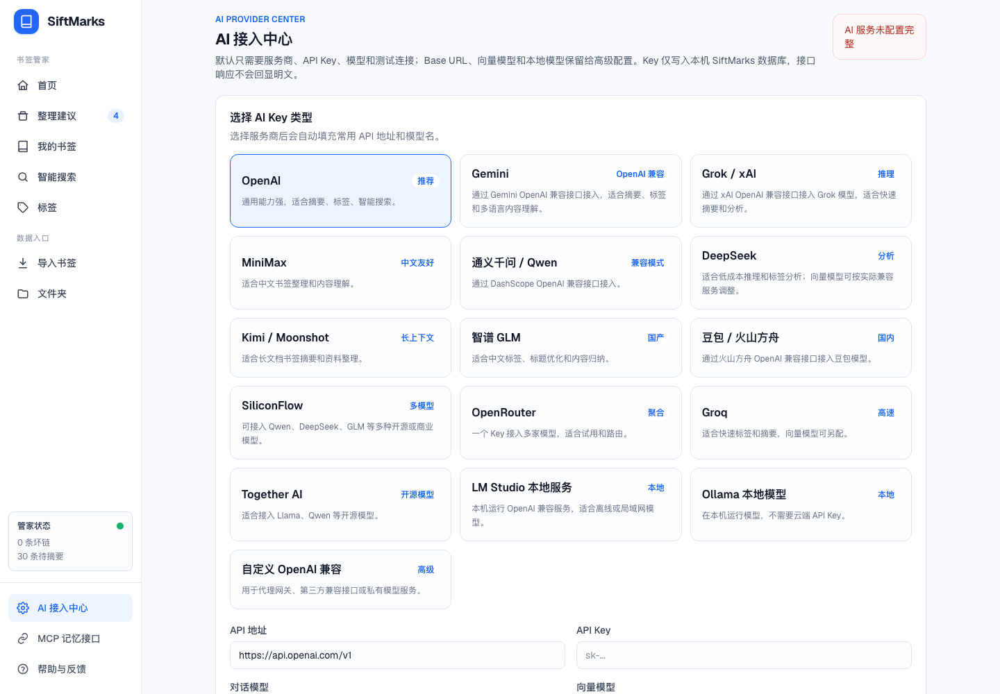

# SiftMarks

简体中文 | [English](./README.en.md)

[](https://github.com/Lling0000/SiftMarks/actions/workflows/ci.yml)
[](./LICENSE)


**把 Chrome 书签变成本地优先、可搜索、可审查、可给 AI 使用的私人上下文层。**

SiftMarks 不是又一个云端收藏夹。它从你已经保存过的浏览器书签出发，把混乱的标题、重复链接、失效页面、错放文件夹整理成一个本地 SQLite 书签库；AI 只负责生成建议，真正改动 Chrome 前必须经过你的审查和确认。

[快速开始](#快速开始) · [Chrome 工作流](#chrome-工作流) · [20 秒演示](./docs/demo/siftmarks-demo.mp4) · [隐私模型](./docs/PRIVACY.md) · [路线图](./docs/ROADMAP.md)


## 30 秒看懂

```text
导入 Chrome 书签
  -> 发现重复、坏链、模糊标题、错放文件夹
  -> 像审查 Pull Request 一样接受或忽略建议
  -> 确认后再写回 Chrome
  -> 通过搜索和 MCP 把书签变成 AI 可用的本地上下文
```

SiftMarks 的核心价值不是“自动替你整理一切”，而是把书签整理做成一个安全闭环：

- **先本地导入**：默认数据落在 `~/.siftmarks/siftmarks.sqlite`。
- **先生成建议**：标题、标签、分类、重复和失效链接都进入待审查列表。
- **先审查再写回**：Web 面板只能准备同步计划，真正改 Chrome 由扩展执行并确认。
- **AI 默认关闭**：Mock 模式不调用外部模型；只有你配置 Provider 并触发 AI 动作后才会发起调用。
- **MCP 可选接入**：把本地书签库暴露给支持 MCP 的 Claude、Cursor、Windsurf 等客户端。

## 适合谁

- 书签栏已经积累多年，想找回“我明明收藏过”的开发者、研究者和创作者。
- 想把 Chrome 书签整理成可搜索知识库，但不想直接交给云端服务的人。
- 想让 AI 工具检索自己的收藏网页、文档、项目和资料，但需要明确本地边界的人。
- 需要审查式整理流程的人：AI 给建议，你决定是否接受，Chrome 不会被静默修改。

## 当前能力

| 能力 | 当前状态 | 边界 |
| --- | --- | --- |
| Chrome 书签导入 | 可用，Web 和扩展都支持 | 通过扩展导入会保留 Chrome ID，方便后续写回 |
| 保存当前页面 | 可用，扩展会调用本地服务 | 页面已在 Chrome 收藏中时沿用原文件夹 |
| 本地书签库 | 可用，SQLite 存储 | 默认路径 `~/.siftmarks/siftmarks.sqlite` |
| 关键词搜索 | 可用，基于 SQLite FTS | 不需要 AI Provider |
| 记忆搜索 | 可用，会优先使用 embedding | 没有 embedding 时回退到关键词式结果 |
| 整理建议 | 可用，支持标题、移动、标签、重复、坏链 | 建议先进入审查，不直接改 Chrome |
| 写回 Chrome | 可用，通过扩展执行 | 需要用户在扩展中确认 |
| AI 元数据 | 可用，支持 OpenAI-compatible 和 Ollama-compatible | Mock 默认不外呼，外部 Provider 需手动配置 |
| MCP Server | 可用 | 只给你配置的 MCP 客户端访问 |
| 普通用户安装包 | 尚未发布 | 当前主要是源码运行 + Chrome 开发者加载 |

## 信任边界

| 场景 | 默认行为 | 什么时候可能离开本机 | 你需要知道 |
| --- | --- | --- | --- |
| 书签库 | 存在本地 SQLite | 不会自动离开本机 | 建议重要操作前备份 `~/.siftmarks/siftmarks.sqlite` |
| Chrome 扩展 | 只连接 `http://localhost:4399` | 不访问外部服务 | 扩展用于导入、保存当前页和写回 Chrome |
| AI | Mock 模式，不调用模型 | 配置云端 OpenAI-compatible Provider 并执行 AI 动作时 | 相关标题、URL、摘要或内容片段可能发给该 Provider |
| 本地模型 | 不需要云端 Key | 如果你的 Ollama/LM Studio/自托管端点不在本机，则取决于你的部署 | SiftMarks 只按你配置的 endpoint 调用 |
| Chrome 写回 | 不自动发生 | 你接受建议并在扩展中确认写回时 | Chrome Sync 开启后，浏览器侧改动可能被 Google 同步 |
| MCP | 默认不接入任何客户端 | 你把 MCP server 配到某个客户端后 | 该客户端可读取你授权暴露的本地书签工具 |

## 快速开始

环境要求：

- Node.js 18+
- npm
- Google Chrome，如果你要使用扩展导入和写回

### 1. 启动本地面板

```bash
git clone https://github.com/Lling0000/SiftMarks.git
cd SiftMarks
npm install
npm run build:packages
npm run dev
```

打开：

```text
http://localhost:4399
```

### 2. 安全试跑，不碰真实书签

这条路径适合第一次体验，所有数据都会写到 `/tmp/siftmarks-demo`。

```bash
SIFTMARKS_HOME=/tmp/siftmarks-demo npm run cli -- init
SIFTMARKS_HOME=/tmp/siftmarks-demo npm run cli -- import examples/bookmarks.html
SIFTMARKS_HOME=/tmp/siftmarks-demo npm run cli -- search "mcp"
SIFTMARKS_HOME=/tmp/siftmarks-demo npm run cli -- rescue
```

### 3. 使用真实 Chrome 书签

1. 保持本地面板运行在 `http://localhost:4399`。
2. 打开 `chrome://extensions`。
3. 开启 **Developer mode / 开发者模式**。
4. 点击 **Load unpacked / 加载未打包的扩展程序**。
5. 选择 `apps/chrome-extension`。
6. 点击 SiftMarks 扩展图标，导入书签或保存当前页面。

## Chrome 工作流

### 导入

你可以从两个入口导入：

- Web 面板：导入浏览器导出的 `bookmarks.html`。
- Chrome 扩展：读取真实 Chrome 书签树，并保留 Chrome ID。

如果你希望后续把整理结果写回原始 Chrome 书签，推荐通过扩展导入。

### 审查整理建议

打开：

```text
http://localhost:4399/rescue
```

整理建议支持：

- 标题优化：把 `Home`、`Untitled`、过短标题改成更可搜索的标题。
- 文件夹移动：根据已有文件夹策略建议移动位置。
- 标签整理：尽量复用已有标签，标签不是越多越好。
- 重复清理：重复 URL 不再二次导入，可进入清理建议。
- 坏链处理：失效链接可标记为本地删除状态。

你可以单条接受，也可以批量接受。接受后先写入本地，涉及 Chrome 的改动会进入待写回计划。

### 写回 Chrome

真正写入 Chrome 必须在扩展里执行：

1. 在 Web 面板接受建议。
2. 预览或准备待写回 Chrome 的计划。
3. 打开 SiftMarks Chrome 扩展。
4. 点击 **写回 Chrome**。
5. 在确认弹窗里确认。

支持写回：

- 改标题
- 移动文件夹
- 删除重复书签
- 删除失效书签
- 创建本地已分类但还未进入 Chrome 的书签

## 扩展权限

当前扩展权限来自 `apps/chrome-extension/manifest.json`。

| 权限 | 用途 |
| --- | --- |
| `bookmarks` | 读取 Chrome 书签树；仅在用户确认写回后改名、移动或删除 |
| `activeTab` | 点击扩展时读取当前标签页标题和 URL，用于保存当前页面 |
| `alarms` | 每天早上 8 点触发本地扫描提醒/状态刷新 |
| `storage` | 保存扩展本地状态，例如上次扫描结果 |
| `http://localhost:4399/*` | 只连接本机 SiftMarks Web API |

## AI Provider

SiftMarks 默认是 **Mock** 模式。Mock 模式不会调用外部 AI API。

| 模式 | 需要什么 | 能做什么 | 数据边界 |
| --- | --- | --- | --- |
| Mock | 不需要 Key | 本地索引、关键词搜索、基础规则整理 | 不调用外部模型 |
| Ollama Compatible | 例如 `http://localhost:11434` 和模型名 | 本地摘要、标签、embedding、分类 | 取决于你的 Ollama 部署位置 |
| LM Studio / 本地 OpenAI-compatible | 例如 `http://localhost:1234/v1` | 通过 OpenAI-compatible 协议调用本地模型 | 不需要云端 Key |
| 云端 OpenAI-compatible | Base URL、API Key、chat model、可选 embedding model | AI 摘要、标签、记忆搜索、整理建议 | 执行动作时会把必要字段发给该 Provider |

配置入口：

```text
http://localhost:4399/settings
```

常见地址：

```text
OpenAI:      https://api.openai.com/v1
Qwen:        https://dashscope.aliyuncs.com/compatible-mode/v1
DeepSeek:    https://api.deepseek.com/v1
Groq:        https://api.groq.com/openai/v1
Ollama:      http://localhost:11434
LM Studio:   http://localhost:1234/v1
```

注意：不是所有聊天模型都支持 embeddings。SiftMarks 只有在你明确配置了向量模型时才会请求 `/embeddings`；否则搜索会回退到关键词/改写查询结果。

## MCP Server

SiftMarks 可以把本地书签库暴露给支持 MCP 的客户端。

构建：

```bash
npm run build:packages
```

启动：

```bash
npm run cli -- mcp
```

Claude Desktop 示例：

```json
{
  "mcpServers": {
    "siftmarks": {
      "command": "node",
      "args": ["/absolute/path/to/SiftMarks/apps/mcp-server/dist/index.js"]
    }
  }
}
```

可用工具：

| 工具 | 用途 |
| --- | --- |
| `search_bookmarks` | 搜索本地书签 |
| `read_bookmark` | 读取单个书签详情 |
| `list_tags` | 列出标签和数量 |
| `list_folders` | 列出文件夹和数量 |
| `find_related_bookmarks` | 查找相关页面 |
| `summarize_collection` | 按标签或文件夹总结集合 |
| `save_bookmark` | 保存新书签 |
| `run_bookmark_rescue` | 生成整理建议 |
| `get_bookmark_stats` | 获取书签库统计 |

## 截图

### 整理建议

像审查 Pull Request 一样接受、忽略或批量应用整理建议。


### 本地书签库

按状态、文件夹、重复情况、缺失元数据和标签筛选。


### 智能搜索

关键词搜索可立即使用；配置 Provider 并生成 embedding 后可获得更强的记忆搜索。


### AI 接入中心

选择 Mock、OpenAI-compatible、Ollama-compatible 或本地模型服务。



## CLI

先构建：

```bash
npm run build:packages
```

常用命令：

```bash
npm run cli -- init
npm run cli -- stats
npm run cli -- doctor
npm run cli -- search "mcp browser automation"
npm run cli -- rescue
npm run cli -- export ./siftmarks-export.json
```

导入浏览器导出的书签 HTML：

```bash
npm run cli -- import ./bookmarks.html
```

生成摘要、标签和 embeddings：

```bash
npm run cli -- index --limit 100
```

如果仍是 Mock 模式，索引不会把书签发给外部模型。

## 项目结构

```text
siftmarks/
  apps/
    web/              本地 Next.js 面板和 API
    cli/              命令行工具
    mcp-server/       MCP stdio server
    chrome-extension/ Chrome 导入和写回扩展

  packages/
    shared/           共享类型和工具
    db/               SQLite schema 和数据访问
    core/             导入、搜索、整理、清理逻辑
    ai/               Mock、OpenAI-compatible、Ollama Provider
    indexer/          FTS、摘要、标签、embedding
```

## 开发和校验

```bash
npm install
npm run build:packages
npm run build
npm run typecheck
npm run lint
```

当前仓库没有统一的 `npm test` 脚本。提交前建议至少跑上面的 build、typecheck 和 lint。

测试导入或整理逻辑时，优先使用临时数据目录：

```bash
SIFTMARKS_HOME=/tmp/siftmarks-test npm run cli -- init
```

## SiftMarks 不是什么

- 不是 Notion、Joplin 或 Logseq 的替代品：它不负责写笔记。
- 不是 ArchiveBox 或 Linkwarden 的替代品：它不主打完整网页归档。
- 不是自动清理器：破坏性改动必须经过审查和确认。
- 不是云端 AI 书签服务：默认没有账号、没有遥测、没有外部 AI 调用。
- 不是已上架的普通用户安装包：当前主要面向源码运行和开发者加载扩展。

## 路线图

当前已包含本地面板、Chrome 扩展导入、写回 Chrome、SQLite 存储、关键词搜索、记忆搜索、整理建议、AI 元数据、MCP Server 和 CLI。

后续计划见 [`docs/ROADMAP.md`](./docs/ROADMAP.md)。重点方向包括更好的文件夹策略、更稳定的语义搜索体验、浏览器扩展发布、桌面 companion app 和更多浏览器支持。

## 贡献

欢迎贡献。开始前请阅读 [`CONTRIBUTING.md`](./CONTRIBUTING.md)。

贡献时请优先保护用户数据：

- 不要绕过确认直接改 Chrome 书签。
- 不要默认启用外部 AI 调用。
- 不要记录 API Key、完整书签导出或用户数据库内容。
- 涉及导入、写回、AI 或 MCP 的改动，需要说明数据流边界。

## License

MIT. See [`LICENSE`](./LICENSE).
